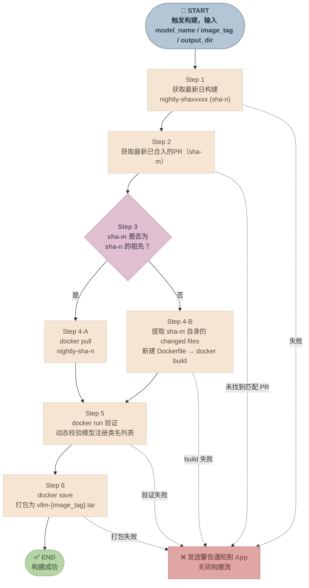

```mermaid
flowchart TB
    START(["🚀 START<br/>触发构建，输入 model_name / image_tag / output_dir"])

    S1["Step 1<br/>获取最新日构建<br/>nightly-shaxxxxx (sha-n)"]

    S2["Step 2<br/>获取最新已合入的PR（sha-m）"]

    S3{"Step 3<br/>sha-m 是否为<br/>sha-n 的祖先？"}

    S4A["Step 4-A<br/>docker pull<br/>nightly-sha-n"]

    S4B["Step 4-B<br/>提取 sha-m 自身的 changed files<br/>新建 Dockerfile → docker build"]

    S5["Step 5<br/>docker run 验证<br/>动态校验模型注册类名列表"]

    S6["Step 6<br/>docker save<br/>打包为 vllm-{image_tag}.tar"]

    END_OK(["✅ END<br/>构建成功"])

    ERR["❌ 发送警告通知到 App<br/>关闭构建流"]

    START --> S1
    S1 --> S2
    S2 --> S3
    S3 -->|是| S4A
    S3 -->|否| S4B
    S4A --> S5
    S4B --> S5
    S5 --> S6
    S6 --> END_OK

    S1 -.->|失败| ERR
    S2 -.->|未找到匹配 PR| ERR
    S4B -.->|build 失败| ERR
    S5 -.->|验证失败| ERR
    S6 -.->|打包失败| ERR

    %% 样式定义 - 莫兰迪色系（低饱和度）
    classDef startEnd fill:#B5C5D5,stroke:#95A5B5,stroke-width:2px,color:#2c3e50,font-weight:bold
    classDef process fill:#F5E6D3,stroke:#E5D6C3,stroke-width:1.5px,color:#5a4a3a
    classDef decision fill:#E0C0D0,stroke:#D0B0C0,stroke-width:2px,color:#6d5a6a,font-weight:bold
    classDef error fill:#E0A5A5,stroke:#D09595,stroke-width:2px,color:#8b5a5a,font-weight:bold
    classDef success fill:#B5D5A5,stroke:#A5C595,stroke-width:2px,color:#5a7a5a,font-weight:bold

    class START startEnd
    class S1,S2,S4A,S4B,S5,S6 process
    class S3 decision
    class ERR error
    class END_OK success
```